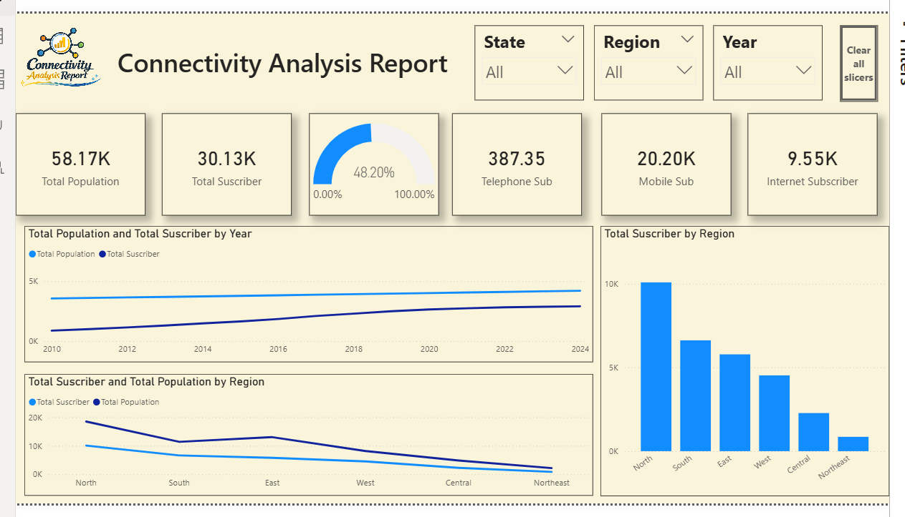

# 📊 Connectivity Analysis Dashboard


---

## 📌 Project Overview

The **Connectivity Analysis Dashboard** is a **Power BI data analytics project** designed to analyze telecommunication connectivity trends across regions and years.

The dashboard provides insights into **population growth, subscriber distribution, and connectivity penetration**, helping identify patterns in telecom adoption and regional connectivity differences.

This project demonstrates **data modeling, dashboard design, and business insight generation using Power BI and DAX**.

---

## 🖼 Dashboard Preview



---

## 🎯 Project Objectives

• Analyze telecom connectivity trends over time
• Compare population vs subscriber growth
• Identify regions with high and low telecom penetration
• Create interactive visualizations for telecom data analysis

---

## 🛠 Tools & Technologies

| Tool          | Purpose                   |
| ------------- | ------------------------- |
| Power BI      | Dashboard Development     |
| DAX           | Measures and Calculations |
| CSV           | Dataset Storage           |
| Data Modeling | Relationship Creation     |

---

## 📂 Project Structure

```
Connectivity-Analysis-Dashboard
│
├── README.md
├── Report.png
│
└── dataset
    ├── Connectivity_Fact_Table.csv
    ├── Date_Dimension.csv
    ├── Geography_Dimension.csv
    ├── Metric_Dimension.csv
    └── README.md
```

---

## 📊 Key Dashboard Metrics

| Metric                | Value  |
| --------------------- | ------ |
| Total Population      | 58.17K |
| Total Subscribers     | 30.13K |
| Connectivity Rate     | 48.20% |
| Mobile Subscribers    | 20.20K |
| Internet Subscribers  | 9.55K  |
| Telephone Subscribers | 387    |

---

## 📈 Key Insights

• Telecom subscriber numbers have **steadily increased over time**
• **North region shows the highest subscriber count**
• **Northeast region has lower connectivity penetration**
• Mobile subscribers dominate over traditional telephone services
• Internet connectivity adoption is gradually increasing

---

## 📐 Example DAX Calculation

```
Connectivity Rate =
DIVIDE([Total Subscriber], [Total Population]) * 100
```

---

## ⚙️ Dashboard Features

• KPI cards for key metrics
• Connectivity rate gauge visualization
• Trend analysis using line charts
• Regional comparison using bar charts
• Interactive filters for Region, State, and Year

---

## 🚀 How to Use

1. Download the **Power BI (.pbix) file**
2. Open it in **Microsoft Power BI Desktop**
3. Explore the dashboard using filters and slicers

---

## 🧠 Skills Demonstrated

• Data Cleaning
• Data Modeling
• Power BI Dashboard Development
• DAX Calculations
• Data Visualization
• Business Insight Generation

---

## 👨‍💻 Author

**Aryansh Dhuria**


GitHub: https://github.com/AryanshDhuria

---

⭐ If you found this project helpful, consider giving it a **star on GitHub**.
